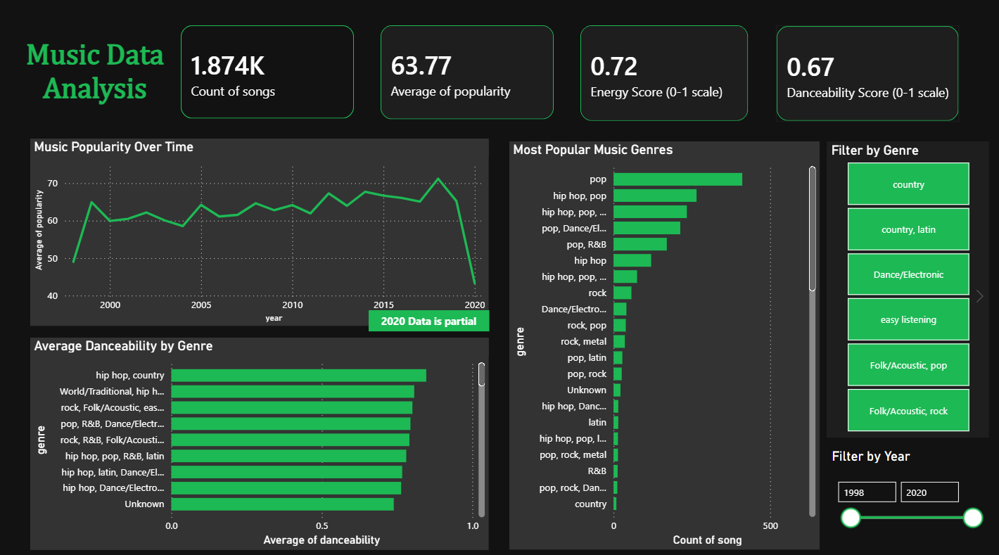

# music-analysis-powerbi

# Music Data Analysis | Power BI Dashboard

## Goal
To explore a dataset of songs and understand the key factors associated with song popularity through data analysis and visualization.
## Description:
This project analyzes a music dataset of 2,000 songs containing audio features such as energy, danceability, popularity, genre, and release year spanning from 1998 to 2020. The objective is to understand the key factors that influence song popularity and identify patterns in music trends over two decades.
The project includes the following steps: data loading, data cleaning and preprocessing in Power Query, exploratory data analysis (EDA), and interactive dashboard development in Power BI.
## Dashboard

## Data Cleaning Steps:

* Removed 148 duplicate songs
* Replaced erroneous genre values (set()) with Unknown
* Handled 126 missing popularity scores
* Converted song duration from milliseconds to minutes
* Standardized genre formatting and trimmed whitespace

## Skills:
Data cleaning, exploratory data analysis (EDA), data visualization, dashboard development.

## Tools used
* Microsoft Power BI
* Power Query
* Excel
  
## Key Learnings

This project strengthened my ability to transform complex data into clear, visual insights to see the whole story. This makes it easier to identify patterns, relationships, and trends that are not easily visible in raw data. 
