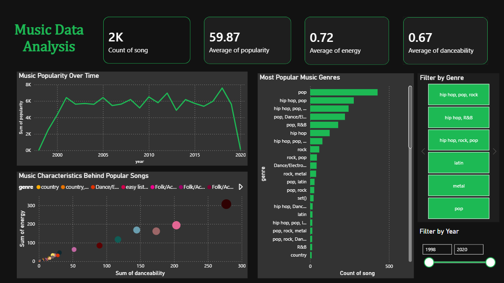

# music-analysis-powerbi

# Music Data Analysis | Power BI Dashboard

## Goal
To explore a dataset of songs and understand the key factors associated with song popularity through data analysis and visualization.

## Description:
This project analyzes a music dataset containing audio features such as energy, danceability, popularity, genre, and release year. The objective is to understand the key factors that influence song popularity and identify patterns in modern music trends.

The project includes the following steps: data loading, data cleaning and preprocessing, exploratory data analysis (EDA), and interactive dashboard development in Power BI to visualize insights.

## Dashboard

## Skills:
Data cleaning, exploratory data analysis (EDA), data visualization, dashboard creation.

## Tools used
* Microsoft Power BI
* Excel
  
## Key Learnings

This project strengthened my ability to transform complex data into clear, visual insights to see the whole story. This makes it easier to identify patterns, relationships, and trends that are not easily visible in raw data. 
